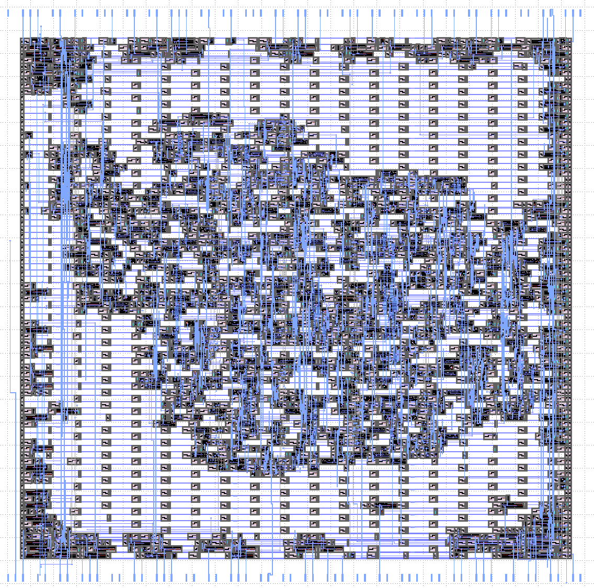

# Single GPS Tracking Channel

Starter project for Zero to ASIC. Only had one week to implement, so this is only a partial tracking channel.

There are two adjustable numercially controlled oscillators (NCOs) whose frequency can be adjusted in software.
There is also a Gold Code generator for all 63 PRN codes. There is a primitive 1-bit mixer that will correlate
an incoming signal (sample on pin 31) with the local oscillator and C/A code and generate an output on pin 21.

# Zero to ASIC Course

This project was made as part of the [Zero to ASIC Course](https://zerotoasiccourse.com)!

# License
This project is [licensed under Apache 2](LICENSE)